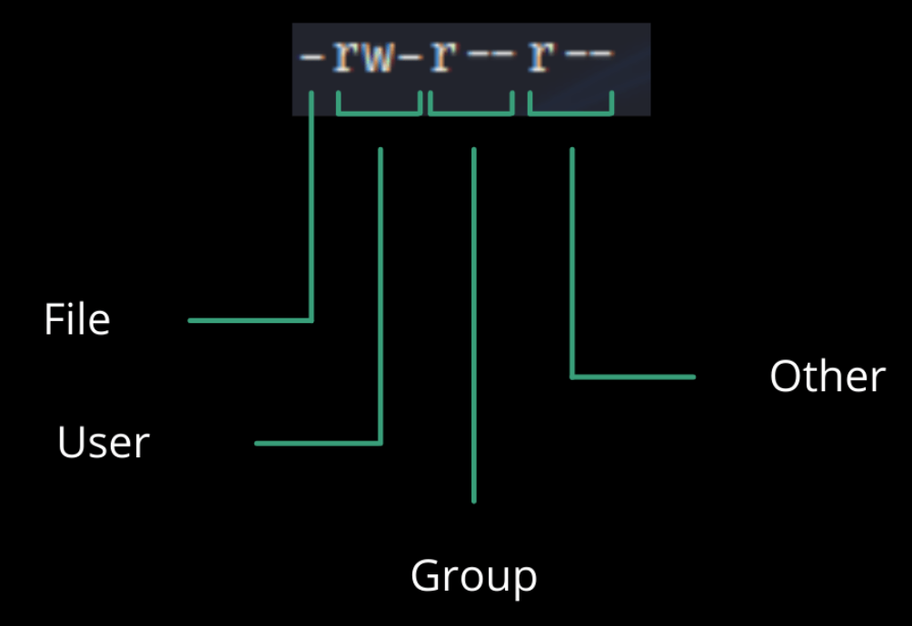

# Apa itu Unix?
**Unix/Linux** adalah set dari program yang bertindak sebagai penhubung antara komputer dengan user.</br>
Program Komputer yang mengalokasikan sumber daya(*resource*) system dan mengkoordinasi semua detail dari internal komputer dinamakan **Operating System** atau **Kernel**.</br>
User berkomunikasi dengan kernel melalui program yang di namakan **shell**. Shell adalah (penerjemah baris perintah)*command line interpreter* yang menterjemahkan perintah yang dimasukkan dari user dan mengubah perintah tersebut menjadi bahasa yang di pengerti **Kernel**.

- Unix di kembangkan pada tahun 1969 oleh karyawan dari group **AT&T** yakni Ken Thompson, Dennis Ritchie, Douglas McIlroy, and Joe Ossanna at Bell Labs.
- Terdapat berbagai jenis Unix sebagai contoh Solaris Unix, AIX, HP Unix dan BSD. unix juga open source aau *free*.
- Beberapa orang dapat menggunakan unix dalam waktu yang bersamaan yang artinya *multiuser*.
- Beberapa orang juga bisa menjalankan program dalam waktu yang bersamaan yang artinya *multitasking*.

## Arsitektur Unix
<p text-align="center">
  <image src="./images/unix_architecture.jpg"/>
</p>

> Terdapat 4 konsep dasar utama dari Unix yaitu:
- **Kernel** - Kernel merupakan jantung dari operating system. kernel berinteraksi dengan hardware dan sebagian bersar tugas nya seperti **memory management**, **task scheduling** dan **file management**.
- **Shell** - Shell adalah tool yang memproses request dari user. Ketika perintah di masukan shell menerjemahkan dan memanggil program yang kamu inginkan. Shell menggunakan perintah yang standar untuk semua perintah. *C Shell*, *Bourne Shell* dan *Korn Shell*  yang paling banyak di gunakan.
- **Commands and Utilities** - terdapat berbagai jenis **Commands and Utilities** yang digunakan sebagai contoh `mv, cp, cat, grep` dll.
- Folder dan file - Semua data di Unix di organisir oleh file. Semua file di organisir oleh folder. Nantinya folder-folder ini akan membentuk susunan cabang yang disebut **file system**.

## Pendahuluan Perintah Shell
### Mengetahui User sekarang
```bash
whoami
```
### Mengetahui siapa saja user yang sedang login
```bash
users
#atau
who
```
### System Shutdown
```bash
#Membuat system down tetapi hardware tetap menyala
halt

#Mematikan system dengan predefine script dan membersihkan system sebelum mematikan
init 0

#Reboots system dengan mematikan komputer sampai selesai lalu menyalakan kembali
init 6

# Mematikan system
poweroff
shutdown

# Reboot System
reboot
```
# Folder dan File Management
## File Management
### Lihat isi folder
```bash
ls
```
### Lihat file dengan *Methacharacters*.
> Lihat semua file dengan format `.txt`
```bash
ls *.txt
```
> Lihat semua file dengan awalan `saya` dan akhiran `.txt`
```bash
ls saya*.txt
```
### Melihat file tersembunyi
```bash
ls -a
```
### Membuat file
```bash
touch saya.txt
```
### Mengedit file
```bash
nano saya.txt
```
### Menampilkan isi file
```bash
cat saya.txt
```
### Meng-Copy file
```
cp saya.txt hallo.txt
```
### Mengganti nama file
```bash
mv saya.txt hello.txt
```
### Menghapus file
```bash
rm saya.txt
```
## Folder Management

### Lihat lokasi sekarang
```bash
pwd
```
### Masuk ke home
```bash
cd ~
```
### Masuk ke root
```bash
cd /
```
### Mundur 1x
```bash
cd ../
```
### Mundur 2x
```bash
cd ../../
```
### Melihat file yang ada di dala folder
```bash
ls foldernya
ls /usr/local
```
### Membuat folder
```bash
mkdir folder1 folder2 folder3
```
### Membuat folder dan subfolder
```bash
mkdir -p ./folder/subfolder
```
### Hapus folder
```bash
rmdir folder1 folder2 folder3
```
### Ganti nama folder
```bash
mv folderlama folderbaru
```


# Permission di Unix
## File dan Folder permission
Terdapat 3 kepemilikan di unix file

- User: Owner dari file (Orang yang membuat file)
- Group: Group dapat memiliki banyak user. Jadi semua user yang berada dalam group tersebut akan memiliki izin yang sama. Menggunakan group akan lebih mudah dalam memberi izin atau *permission*.
- Other: Siapa saja dapat mengakses file.

Lihat file dengan izinnya
```bash
ls -l 
```
Huruf pertama merupakan tipenya, jika `-` berarti file namun jika `d` maka folder.‘r’ = read. ‘w’ = write. ‘x’ = execute. ‘-’ = no permission.


## Mengubah permission
Bisa menggunakan `chmod` terdapat dua cara yaitu:
### 1. Symbolic Mode
   - (+) Menambahkan permission
   - (-) Menghapus permission
   - (=) Set permission
   - "u" User
   - "o" Others
   - "g" Group
   - "a" All
```bash
touch test
ls -l test
# -rw-rw-r-- 1 zulfikar zulfikar 0 Feb 10 20:42 test
chmod a-rw test
# ---------- 1 zulfikar zulfikar    0 Feb 10 20:42 test
chmod u+rx test
# -r-x------ 1 zulfikar zulfikar 0 Feb 10 20:42 test
chmod g+x test
# -r-x--x--- 1 zulfikar zulfikar 0 Feb 10 20:42 test
chmod o+r test
# -r-x--xr-- 1 zulfikar zulfikar 0 Feb 10 20:42 test
chmod a+w test
# -rwx-wxrw- 1 zulfikar zulfikar 0 Feb 10 20:42 test
chmod gu+w test
```
### 2. Absolute Permission
  - 0 = ---
  - 1 = --x
  - 2 = -w-
  - 3 = -wx
  - 4 = r--
  - 5 = r-x
  - 6 = rw-
  - 7 = rwx

```bash
chmod 000 test
# ---------- 1 zulfikar zulfikar 0 Feb 10 20:42 test
chmod 345 test
# --wxr--r-x 1 zulfikar zulfikar 0 Feb 10 20:42 test
chmod 777 test
# -rwxrwxrwx 1 zulfikar zulfikar 0 Feb 10 20:42 test
```

## Mengubah Owner dan Group
Saat membuat akun di Unix, terdapat *owner ID* dan *group ID*. Terdapat dua perintah untuk mengubah ownership.
- **chown** - Change Owner
- **chgrp** - Change Group

### Mengubah Owner
```bash
chown usernya test
```
### Mengubah Group
```bash
chown group test
```
## Spesial Permission
Contoh kasus, bagaimana bisa non-root user bisa mengganti password dirinya sendiri padahal dia sendiri tidak punya akses ke /etc/shadow file.
```bash
ls -lrt /usr/bin/passwd
# -rwsr-xr-x 1 root root 68208 Jul 15  2021 /usr/bin/passwd
```
terdapat `s` di yang berarti **SUID**, jika `s` nya di grup maka **SGID**
```bash
chmod ug+s test
```